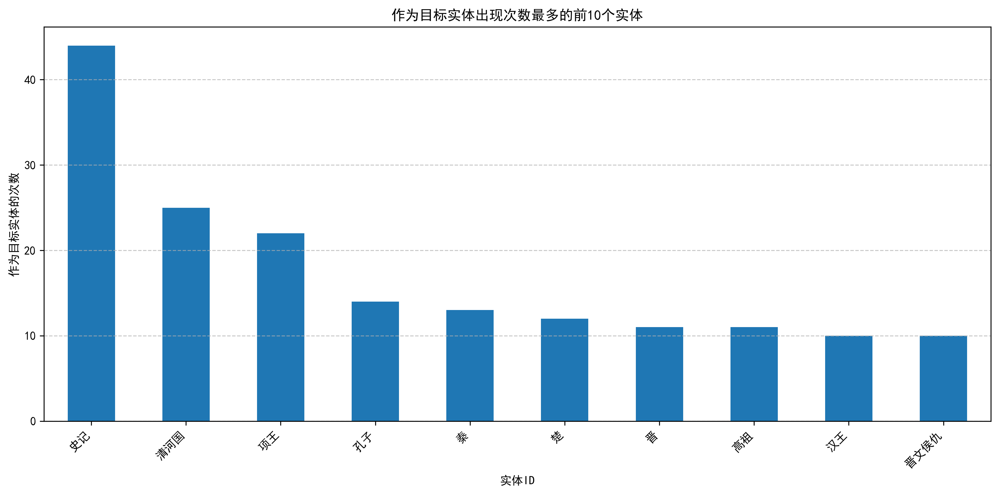

# 中国历史知识图谱 —— 基于实体与关系的历史文本挖掘
Chinese History Knowledge Graph: Entity and Relation Based Historical Text Mining

## 📜 项目简介

本项目以《二十四史》为数据源，利用自然语言处理与知识图谱技术，从原文中系统性地抽取**实体**（人物、地点、事件、官职、礼制等）及其之间的**语义关系**，构建了一个结构化的《二十四史》的知识图谱。通过该图谱，研究者与爱好者可以直观探索《二十四史》中庞杂的人物网络、地理沿革、政治事件以及礼乐星象等文化维度。

> “究天人之际，通古今之变，成一家之言。” —— 本图谱旨在以数据驱动的方式，再现太史公笔下的宏伟世界。

---

## 01.📊 《史记》图谱规模一览

| 指标 | 数值 |
| :--- | :--- |
| **实体总数** | 2,359 |
| **关系总数** | 1,783 |
| **实体类型种类** | 22 |
| **关系完整度** | 100%（每条关系均有描述） |
| **最大出度实体** | **汉**（81条关系） |
| **最大入度实体** | **史记**（44条关系） |

---

## 🧩 实体类型分布

| 类型 | 数量 | 占比 |
| :--- | :--- | :--- |
| 👤 人物 | 747 | 31.7% |
| 🏞️ 地点 | 351 | 14.9% |
| 🙏 仪式/宗教实践 | 218 | 9.2% |
| ⌛ 年代标记 | 212 | 9.0% |
| 👑 君主头衔 | 183 | 7.8% |
| 📖 经典文献/注释 | 146 | 6.2% |
| ⚙️ 官职 | 133 | 5.6% |
| 🌏 国家/政权 | 108 | 4.6% |
| ⚔️ 政治事件 | 82 | 3.5% |
| 🌠 天文/宇宙现象 | 72 | 3.1% |
| 其他类型 | 107 | 4.5% |
> 其他类型包括：军事冲突（43）、族群（21）、材料（11）、朝代（10）、亲属关系（5）、动物（4）等。


---

## 🔍 核心实体与网络枢纽
### 出度最高（影响力辐射最强）
| 实体 | 出度 | 说明 |
| :--- | :--- | :--- |
| **汉** | 81 | 作为西汉核心王朝，关联诸侯分封、推恩令、匈奴战争、边疆治理等 |
| **项羽** | 63 | 楚汉争霸中心，连接巨鹿之战、鸿门宴、分封诸侯等 |
| **史记** | 45 | 各本纪、世家、列传、书表均指向《史记》，汇聚注疏版本 |
| **秦** | 17 | 统一六国、制度变革、焚书坑儒等重大事件 |


### 入度最高（被引用最频繁）
| 实体 | 入度 | 说明 |
| :--- | :--- | :--- |
| **史记** | 44 | 各类注疏、版本、评论均以《史记》为靶心 |
| **汉** | 43 | 大量事件、人物、地点归属汉朝 |
| **项羽** | 37 | 众多人物、战役、政治事件围绕项羽展开 |
| **舜** | 37 | 五帝系统核心，禅让、德治典范 |



---

## 🔗 典型关系示例
| 源实体 | 目标实体 | 关系类型 | 原文依据 |
| :--- | :--- | :--- | :--- |
| 项羽 | 范增 | 君臣/谋略 | 范增劝项梁立楚怀王，后为项羽亚父 |
| 汉王 | 韩信 | 军事合作 | 与淮阴侯韩信期会而击楚军 |
| 司马迁 | 史记 | 著作 | 太史公著《史记》 |
| 推恩令 | 诸侯国 | 政治改革 | 齐分为七，赵分为六，梁分为五 |
| 荧惑 | 兵/丧/饥 | 占星关联 | 荧惑为勃乱，残贼、疾、丧、饥、兵 |
| 扁鹊 | 齐桓侯 | 医患 | 扁鹊过齐，齐桓侯客之 |

---
## 📁 项目文件说明

| 文件 | 内容 |
| :--- | :--- |
| `entities.csv` | 实体清单。包含 `id`、`type`、`description`、`frequency`、`degree` 字段 |
| `relationships.csv` | 关系清单。包含 `human_readable_id`、`source`、`target`、`description`、`weight`、`combined_degree` 字段 |
| `README.md` | 项目说明文档（本文件） |

---
## 🛠️ 数据字段说明
### entities.csv

| 字段 | 说明 |
| :--- | :--- |
| `id` | 实体唯一标识（中文名称） |
| `type` | 实体类型（如 PERSON、PLACE、STATE、CLASSICAL_TEXT等） |
| `description` | 实体描述（含原文出处及解释） |
| `frequency` | 在原文中出现的频次 |
| `degree` | 在图谱中的度数（连接数） |

### relationships.csv

| 字段 | 说明 |
| :--- | :--- |
| `human_readable_id` | 关系唯一编号 |
| `source` | 关系源实体 |
| `target` | 关系目标实体 |
| `description` | 关系描述（含原文及解释） |
| `weight` | 关系权重（反映语义强度） |
| `combined_degree` | 源与目标实体度数之和 |

---

## 🚀 应用场景

- **历史研究**：快速检索人物关联、事件脉络、地理沿革
- **数字人文**：支持可视化分析、社交网络挖掘、时空路径构建
- **教育传播**：辅助《史记》教学，生成互动式知识图谱
- **NLP 基准**：作为古文实体识别与关系抽取的标准数据集

---

## 📈 图谱示例（概念图）
```
                     ┌─────────────┐
                     │    汉       │◄────┐
                     │  (出度81)   │     │
                     └──────┬──────┘     │
                            │            │
          ┌─────────────────┼─────────────────┐
          │                 │                 │
    ┌─────▼─────┐     ┌─────▼─────┐     ┌─────▼─────┐
    │  推恩令    │    │  匈奴      │     │ 诸侯国     │
    └───────────┘     └───────────┘     └───────────┘
          │                 │                 │
          └─────────────────┼─────────────────┘
                            │
                      ┌─────▼─────┐
                      │  史记     │
                      │ (入度44)  │
                      └───────────┘
```

---

## 📚 数据来源

所有实体与关系均抽取自 **《史记》** 原文（含《四库全书总目提要》及相关注疏），经人工校对与结构化整理。

---

## 🤝 贡献指南

欢迎通过 Issue 或 Pull Request 参与完善：

- 补充遗漏的实体或关系
- 修正描述性错误
- 增加新的实体类型或关系类别
- 提供可视化分析脚本

---

## 📧 联系方式
如有任何问题或建议，请通过 GitHub Issue 联系。
yanhe0929atgmail.com
